# 2025年你必须了解的12款顶级AI驱动SEO优化工具

现在做内容营销,不只要盯着Google搜索结果,还得考虑ChatGPT、Perplexity这些AI平台会不会引用你的内容。传统的SEO工具只能告诉你关键词难度和排名位置,但新一代AI SEO工具能同时优化你在传统搜索引擎和生成式AI平台上的可见度。这份清单整理了12个值得关注的SEO优化平台,涵盖内容优化、关键词研究、竞品分析、技术审计等核心功能,帮你在AI搜索时代保持竞争力。

***

## **[Rankability](https://www.rankability.com)**

针对Google和ChatGPT双重优化的AI SEO软件。

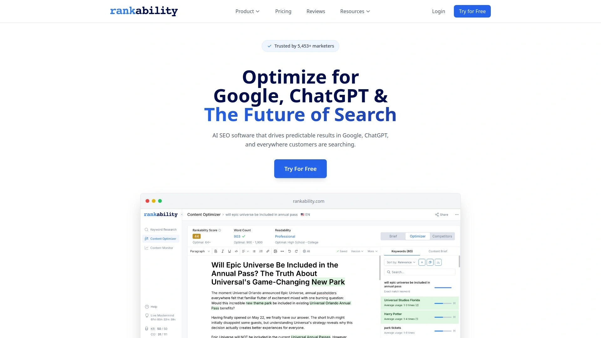

Rankability是一个专注于现代搜索环境的SEO平台,核心特点是能同时优化你在传统搜索引擎(Google、Bing)和生成式AI平台(ChatGPT、Perplexity等)上的表现。平台提供完整的工具套件,包括内容优化、关键词研究、排名监控等功能,所有工具都基于AI驱动的数据分析。

这个工具最大的优势是理解"未来搜索"的概念。当你用Rankability优化内容时,系统会分析哪些因素能让你的文章既在Google SERP上排名靠前,又能被ChatGPT等AI工具引用为可信来源。平台内置的内容编辑器会实时显示优化建议,告诉你哪些地方需要补充关键词、调整结构或增加主题覆盖深度。

**适用场景:** 特别适合需要规模化管理多个客户项目的营销机构。Rankability的企业级功能支持团队协作,可以为不同客户创建独立项目空间,统一管理关键词追踪、内容审计和优化任务。定价采用订阅制,所有计划都包含7天免费试用,可以先测试再决定。

**技术特点:** 平台整合了50多个SEO相关的功能模块,数据来源包括143个全球数据库、259亿关键词索引和43万亿条外链记录。这些数据支持你进行精准的竞品分析,找出竞争对手的内容策略和薄弱环节。

---

## **[Semrush](https://www.semrush.com)**

全球SEO专业人士首选的综合型营销平台。

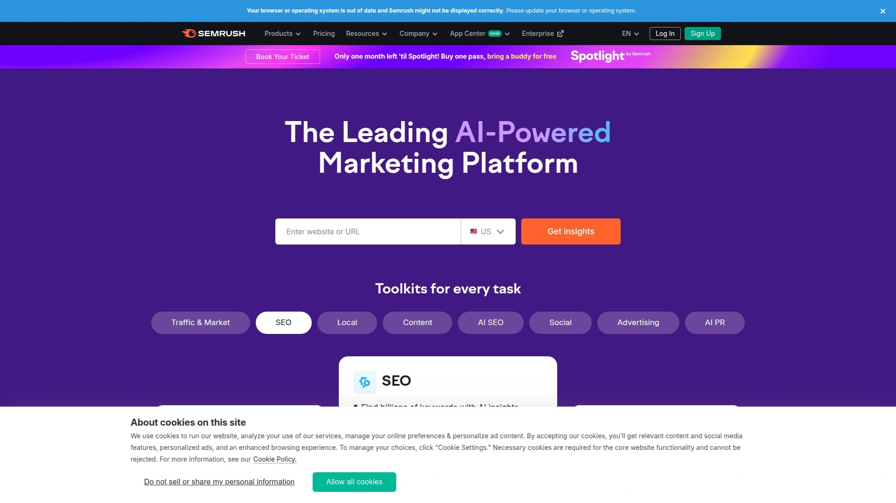

Semrush是SEO工具领域的老牌巨头,2008年成立至今已经有超过1000万数字营销人员在使用。平台最初以竞品分析起家,现在已经发展成一个包含55+产品和工具的完整营销套件。你能用它做关键词研究、网站审计、外链分析、内容营销、社交媒体管理,甚至广告投放监控。

关键词数据库是Semrush的核心竞争力之一,覆盖120多个国家的266亿搜索词。你可以按搜索意图、关键词难度、SERP特征等维度筛选,还能看到每个关键词在Amazon、YouTube、Google等不同平台的表现。最近Semrush还增加了AI搜索可见度追踪功能,能监控你的品牌在ChatGPT、SearchGPT、Gemini、Perplexity等AI平台上的曝光情况。

Semrush有个独家功能叫"个性化关键词难度评分"。大多数工具只会告诉你某个词的整体竞争强度,但Semrush会根据你网站的主题权威度、外链质量和历史表现,计算出这个词对你的站点来说到底有多难。这个功能非常实用,能帮你筛选出真正值得投入的关键词。

价格从每月139.95美元起步,有限制功能的免费版可用。对于需要管理多个客户的机构来说,Semrush的投资回报率相当高。

***

## **[Ahrefs](https://ahrefs.com)**

外链分析和关键词研究的行业标杆。

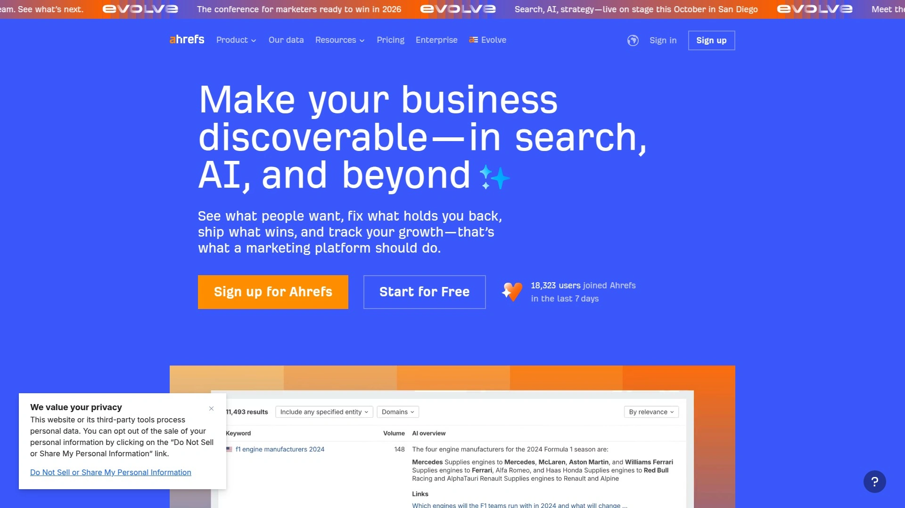

Ahrefs自称是"由大数据驱动的AI营销平台",这个说法并不夸张。他们的网络爬虫是业内第二活跃的(仅次于Google),数据库包含100万亿条外链和5000万个索引域名。如果你需要分析竞争对手的外链来源、找出高质量的链接机会,Ahrefs基本上是绕不开的选择。

关键词研究工具覆盖170个国家的70亿关键词,每个词都有详细的指标——搜索量、CPC、难度评分、点击率分布等。"Having same keywords"功能特别好用,能快速找出一批相关的长尾词,并且可以按难度、搜索量、所需字数等条件过滤,直接筛出最值得做的那些。

Ahrefs的Site Explorer可以输入任何网站URL,看到它的流量估算、排名关键词、热门页面、外链分布等完整画像。很多人用这个功能来反向工程竞争对手的内容策略——看他们哪些文章带来最多流量,这些文章瞄准了什么关键词,然后针对性地创作更好的内容去超越他们。

Chrome浏览器扩展程序免费提供基础功能,付费订阅能解锁完整的Ahrefs指标数据。对于专注外链建设和竞品分析的团队来说,Ahrefs是必备工具。

***

## **[Surfer SEO](https://surferseo.com)**

页面内容优化的实战利器。

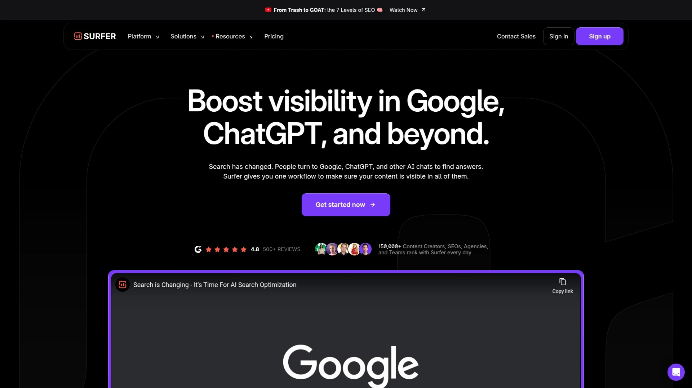

Surfer SEO专注于一件事:让你的内容在搜索结果中排名更高。平台会分析超过500个页面排名信号,告诉你top-ranking页面都有哪些共同特征,然后给出具体的优化建议。这种方法的逻辑是"复制成功模式"——既然这些页面能排第一,那你只要做得跟它们一样(或更好),自然也能上去。

Content Editor是核心功能,你在里面写内容时会实时看到SEO评分。系统会提示你"这个关键词出现次数太少""这段话密度太高""建议增加2-3个H2标题"之类的具体改进点。点击"Auto-Optimize"按钮,AI会自动调整内容结构和关键词分布,省去手动修改的麻烦。

Content Audit功能可以扫描你网站上的所有内容,标记出哪些页面表现下滑、哪些还有优化空间。系统每周会发邮件提醒你"这5篇文章需要更新了",并给出详细的优化方案。这种主动推送机制确保你不会遗漏掉任何流量下降的信号。

Surfer SEO的Topical Map工具能根据行业趋势生成新内容创意,帮你建立完整的主题集群。定价从每月189美元起,适合内容团队、自由撰稿人、营销机构和电商创业者使用。

***

## **[Clearscope](https://www.clearscope.io)**

语义SEO和内容相关性专家。

Clearscope用AI分析搜索结果,找出那些"你应该写但还没写"的主题和关键词。它不只是简单地列出关键词密度,而是基于自然语言处理(NLP)技术,理解哪些概念、问题和相关词汇需要在你的内容中出现,才能让搜索引擎认为你这篇文章有足够的主题权威度。

平台的"Trending"标签是个亮点。当某个关键词的最新搜索量比两个月前增长50%以上时,系统会自动标记为"趋势词"。这让你能抢在竞争对手之前发现新兴话题,及时产出相关内容占领先机。比如你做旅游博客,搜"ski resort"时发现"Snowbird Utah ski resort"正在trending,那现在就是发布相关攻略的最佳时机。

Content Optimizer里有个常见问题列表功能,直接显示用户在搜这个主题时最关心的问题。比如写"Snowbird Utah ski resort"时,系统会提示你加入"新手能在Snowbird滑雪吗?""几月去Snowbird最好?"这些问题。回答这些问题不仅能提升Google排名,还能增加被ChatGPT等AI平台引用的概率。

Clearscope集成了Google Docs、WordPress和Microsoft Word,可以直接在写作工具里调取实时数据。定价从每月189美元起,提供7天免费试用。适合专注于打造主题权威度的内容创作者。

***

## **[MarketMuse](https://www.marketmuse.com)**

AI驱动的内容策略和差距分析平台。

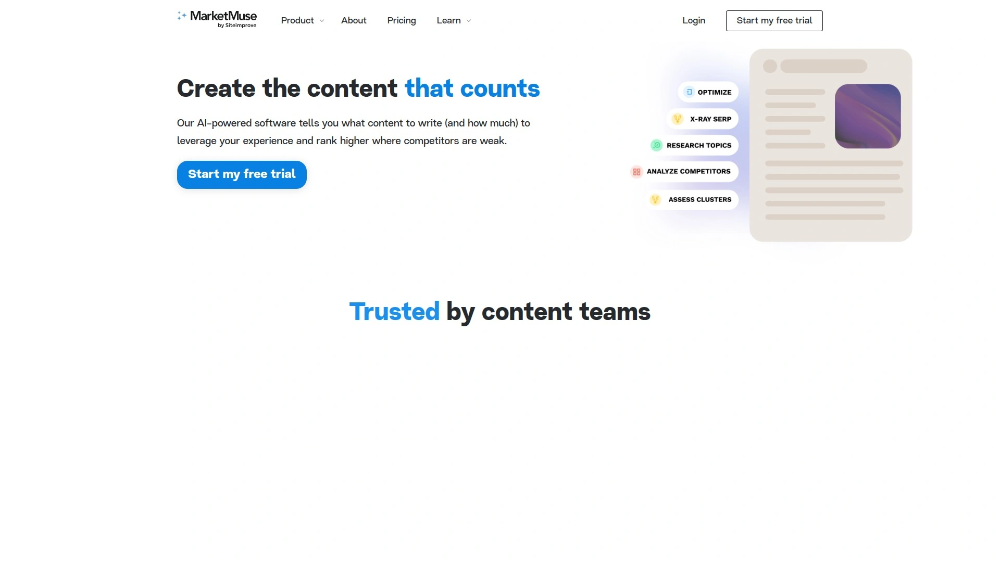

MarketMuse最擅长的是告诉你"你的内容库里缺什么"。平台使用专利的主题建模技术,分析数十万个页面来识别某个主题下最重要的概念。然后把你现有的内容跟这个理想模型对比,找出哪些子主题你没有覆盖、哪些地方讲得不够深入。

On-Demand Inventory功能可以全面扫描你的网站,给出每个主题的内容强度评分。你能清楚地看到自己在哪些领域有足够的主题权威度,哪些地方存在明显短板。这种洞察对于制定内容日历非常有价值——优先填补那些高价值的内容空白。

MarketMuse的个性化指标会告诉你,某个关键词对你的网站来说有多难。不同于通用的难度评分,这个指标会考虑你站点的竞争内容优势,给出更精准的预判。Content Brief生成器可以自动创建详细的写作提纲,列出需要覆盖的主题、要回答的问题、建议包含的链接等,让作者和SEO策略师在同一频道上。

MarketMuse是世界上唯一提供内容集群分析的平台,能评估你在某个主题下的内容集群覆盖范围和深度。2024年MarketMuse被Siteimprove收购,未来可能会有更多功能整合。适合需要大规模内容运营的团队和机构。

***

## **[Frase](https://frase.io)**

兼顾SEO和GEO的内容优化工具。

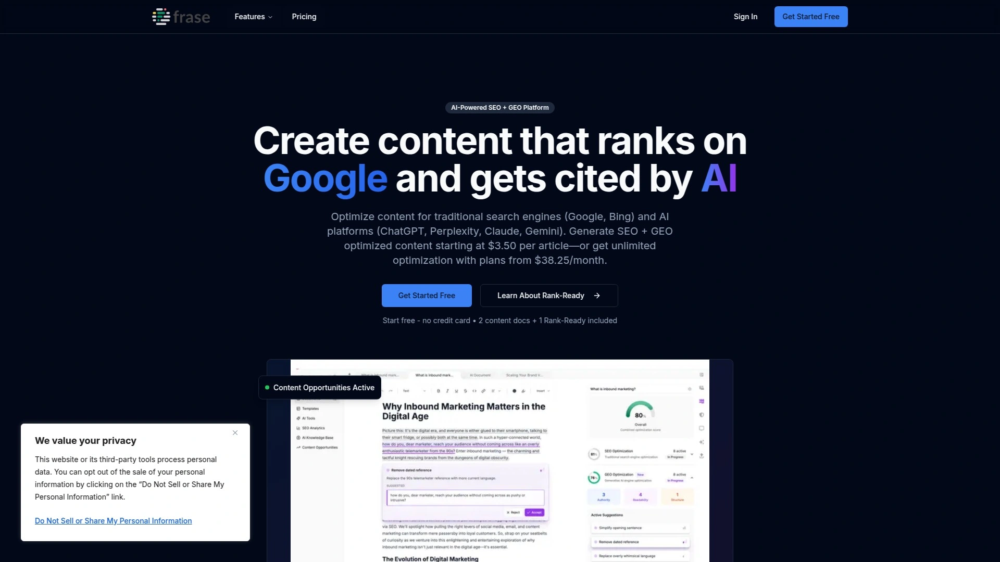

Frase是少数同时支持SEO和GEO(生成式引擎优化)的工具之一。你在Frase里优化内容时,会同时看到两个评分:一个是针对Google等传统搜索引擎的SEO分数,另一个是针对ChatGPT、Perplexity、Claude、Gemini等AI平台的GEO分数。这种双轨制评分系统确保你的内容在两个搜索环境下都能表现出色。

工作流程很直接:输入目标关键词,Frase会抓取Google前20名结果进行分析,识别出排名页面的共同主题、问题和内容模式。然后系统提取用户常问的问题——回答这些问题是提升AI平台引用率的关键,因为AI平台优先引用那些直接回答用户查询的内容。

AI大纲生成器会基于SERP分析创建完整的内容框架,包括标题、副标题和建议的内容结构。你在编辑器里写作时,实时看到SEO和GEO评分变化,系统给出的优化建议也是双重的——"这个改动能提升Google排名"或"这样调整有助于AI平台引用"。

Frase的实时推荐包括主题覆盖度、可读性改进、结构建议和AI友好格式,所有提示都会随着你的写作动态更新。适合需要在传统搜索和AI搜索两个战场同时发力的内容团队。

***

## **[SE Ranking](https://seranking.com)**

性价比极高的全功能SEO平台。

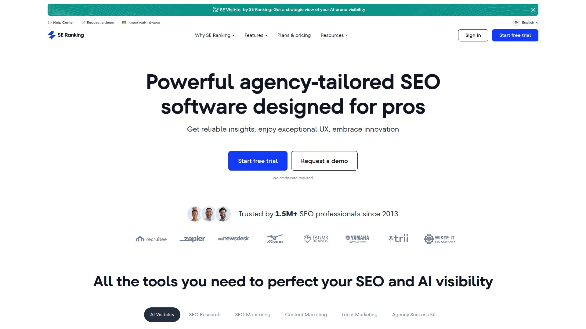

SE Ranking是一个工具齐全但价格亲民的SEO平台,特别适合预算有限的中小企业、自由职业者和小型机构。平台的核心功能一个不少——关键词追踪、竞品分析、网站审计、外链检查、排名监控,该有的都有,但订阅费用比Semrush或Ahrefs便宜不少。

关键词排名追踪器可以监控你在Google、Bing、Yahoo上的排名表现,支持任意地区、语言和设备。你可以分别追踪桌面端和移动端排名,还能看到每个关键词触发了哪些SERP特征(精选摘要、视频、图片等)。AI Results Tracker是个新功能,能追踪你的网站在AI Overview结果中被引用的情况。

网站审计工具会检查所有页面和子域名,针对每个发现的问题给出紧急程度评级和修复建议。比如发现404错误、重定向链、缺失的meta标签、重复内容等技术问题,系统会告诉你哪些需要立即处理,哪些可以稍后优化。

SE Ranking的移动应用做得不错,订阅后可以在手机上查看所有数据和报告。平台提供14天免费试用,不需要信用卡,可以充分测试所有功能再决定是否购买。对于个人站长和小团队来说,SE Ranking是理想的入门选择。

***

## **[Writesonic](https://writesonic.com)**

AI内容创作与SEO优化的一体化方案。

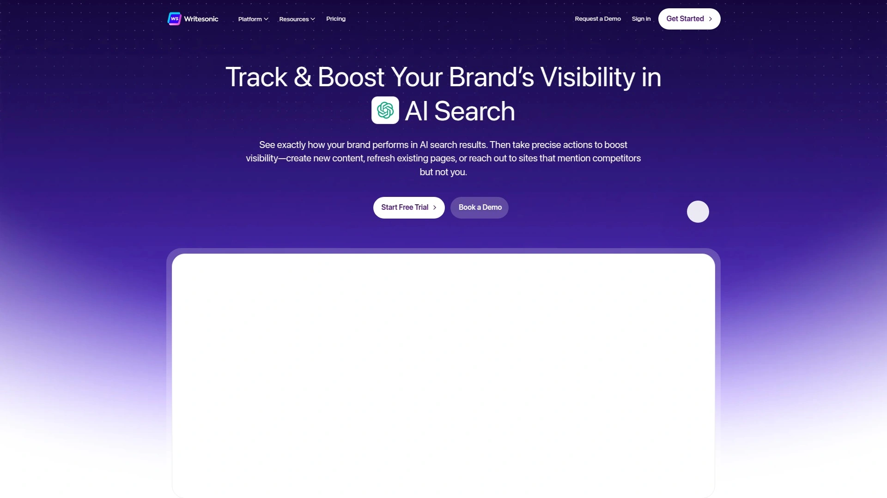

Writesonic最初以AI写作工具出名,现在已经进化成一个集内容生成、SEO优化和AI可见度追踪于一体的综合平台。最大的特点是把写作和优化无缝整合——你用AI生成的内容本身就已经做过基础SEO优化,不需要再导出到其他工具里二次加工。

GEO工具(生成式引擎优化)可以追踪你的内容在AI Overview、ChatGPT等大语言模型中的出现情况。你能看到品牌在这些AI平台上的曝光频次、被引用的具体上下文,以及哪些来源被AI认为最可信。这对于理解和优化"AI搜索可见度"非常重要。

SEO AI Agent是个基于对话的AI助手,可以通过自然语言指令完成关键词聚类、内部链接建议、内容简报生成、竞品分析等任务。它能整合Ahrefs、Google Search Console等第三方数据源,把多个工具的功能集中到一个聊天界面里操作。

内置的SEO检查器会实时显示内容评分,给出关键词使用、标题结构、可读性等方面的改进建议。Canvas功能让你能可视化地规划内容策略,用可重复的模块管理研究、策划和执行流程。Writesonic支持多个AI模型(GPT-4、Claude、Gemini等),还有不少免费工具可以在不订阅的情况下使用。

***

## **[SearchAtlas](https://searchatlas.com)**

主打AI自动化的新一代SEO平台。

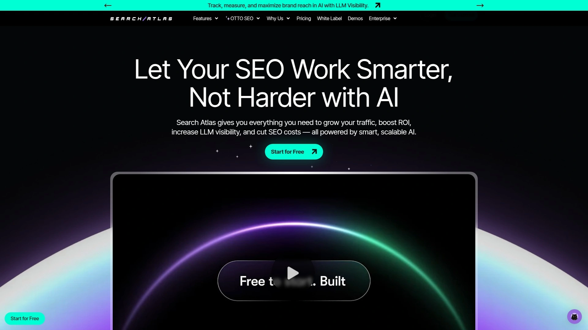

SearchAtlas的核心卖点是"AI自动化",不只是给建议,而是直接帮你完成任务。很多SEO工具会告诉你"这个页面加载太慢""这个链接坏了",但SearchAtlas会进一步告诉你怎么修,甚至在某些情况下自动执行修复。

关键词研究工具拥有52亿关键词的数据库,提供搜索量、CPC、难度和搜索意图等完整指标。Magic Tool可以把相关关键词按主题聚类,帮你构建内容策略。排名追踪是每日更新而非每周更新,数据刷新速度比大多数竞品快,能更及时地发现排名波动。

平台直接连接Google Search Console,避免了网络抓取可能导致的数据偏差。你可以同时查看桌面、移动和本地搜索的排名数据,系统会标注每个关键词触发的SERP功能,让你全面了解自己的搜索可见度。

网站审计采用实时扫描而非定时爬取,一旦发现新问题立即发出警报,不用等下次计划扫描。外链分析器基于100万亿外链和5亿索引域名的庞大数据库,这个规模比很多竞品大得多。虽然SearchAtlas还算是个相对年轻的品牌,但在自动化和实时性方面已经展现出明显优势。

***

## **[Yoast SEO](https://yoast.com)**

WordPress网站的SEO优化插件首选。

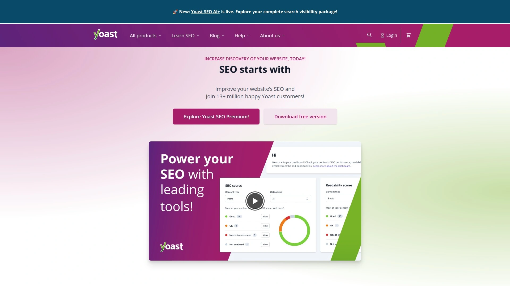

Yoast SEO是WordPress生态里最受欢迎的SEO插件,全球安装量超过500万。如果你的网站是用WordPress搭建的,Yoast基本上是必装项。插件免费版已经包含了大部分基础功能,对于个人博客和小网站来说完全够用。

插件在WordPress编辑器里直接显示SEO分析结果,检查标题、meta描述、关键词密度、可读性等指标,用红黄绿三色标记哪些地方需要改进。你写完文章点击发布前,Yoast会给出一个综合评分,告诉你这篇内容的SEO质量如何。

高级版增加了内部链接建议、内容洞察、重定向管理、多重焦点关键词等功能。插件还能自动生成XML站点地图、设置canonical标签、控制索引指令,这些技术细节对SEO很重要但手动处理很繁琐,Yoast都帮你自动搞定。

Yoast的可读性分析工具会检查句子长度、段落结构、过渡词使用等,确保内容不只对搜索引擎友好,对真实读者也友好。虽然功能没有Semrush或Ahrefs那么全面,但作为WordPress专属的on-page优化工具,Yoast的易用性和针对性无人能及。

***

## **[Google Search Console](https://search.google.com/search-console)**

来自Google官方的免费SEO工具。

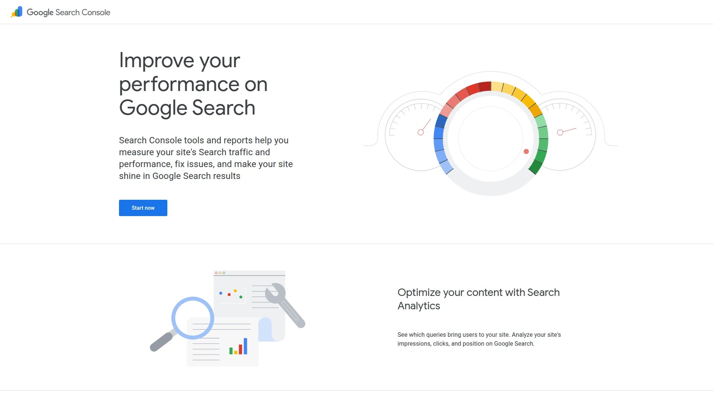

这是Google提供的免费工具,任何网站都应该接入。Search Console能告诉你Google是怎么看待你网站的——哪些页面被索引了、哪些页面有问题、用户通过哪些搜索词找到你、每个页面的点击率和展示次数等等。这些都是第一方数据,准确度比任何第三方工具都高。

Performance报告显示你网站在Google搜索结果中的总体表现,可以按查询词、页面、国家、设备等维度筛选。你能看到哪些关键词带来了最多展示但点击率很低,说明标题或描述不够吸引人,需要优化。哪些页面排在第5-10位,这些是最容易提升的"低垂果实"。

Coverage报告列出所有索引问题——哪些页面被抓取但没索引、哪些因为robots.txt被屏蔽、哪些有重定向错误等。每个问题都有详细说明和修复建议。Core Web Vitals报告显示页面加载速度、交互响应、视觉稳定性等用户体验指标,这些现在也是排名因素。

虽然Search Console不提供关键词建议或竞品分析,但它是了解网站真实表现的基础。所有SEO工作都应该从这里的数据出发,而不是依赖第三方工具的估算。完全免费,没有理由不用。

***

## **[Screaming Frog](https://www.screamingfrog.co.uk)**

技术SEO审计的专业级工具。

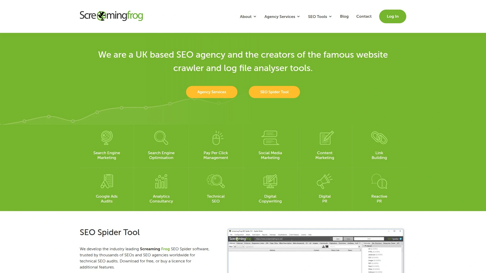

Screaming Frog是一个桌面应用程序,专门用来做技术SEO审计。它会像搜索引擎爬虫一样抓取你的整个网站,然后生成详细的技术报告——哪些页面有404错误、哪些重定向链太长、哪些图片缺少alt标签、哪些meta描述太长或太短、哪些页面加载时间过久等等。

这个工具的数据量可以很庞大,特别适合分析大型网站。免费版可以爬取500个URL,对小网站够用。付费版没有URL限制,还能整合Google Analytics、Search Console数据,进行更深度的分析。

Screaming Frog可以批量提取页面元素,比如一次性导出所有页面的标题、H1标签、canonical标签,放到Excel里统一检查和修改。这对于大规模网站的SEO审计来说能省下大量时间。工具还能发现孤立页面(没有内链指向的页面)、识别重复内容、检查hreflang标签的正确性。

界面不太友好,有一定学习曲线,但功能强大。适合专业的SEO从业者、技术团队和需要深度诊断网站问题的场景。很多大型机构都把Screaming Frog作为技术审计的标准工具。

***

## 常见问题

**AI SEO工具和传统SEO工具的区别是什么?**

传统SEO工具主要优化你在Google、Bing等搜索引擎的排名,关注关键词、外链、页面结构这些因素。AI SEO工具除了这些基础功能,还会追踪你的内容在ChatGPT、Perplexity等生成式AI平台的曝光和引用情况。现在越来越多人直接问AI问题而不是搜Google,所以你的内容需要同时针对两种搜索环境优化。Rankability、Frase、Writesonic这类新工具已经整合了GEO(生成式引擎优化)功能,能帮你在AI搜索时代保持可见度。

**选SEO工具主要看哪些功能?**

核心功能包括关键词研究、排名追踪、网站审计、竞品分析和内容优化。如果你主要做内容营销,优先选Surfer SEO、Clearscope这种强调内容优化的工具。如果需要分析竞争对手的外链策略,Ahrefs或Semrush更合适。预算有限的小团队可以从SE Ranking或Google Search Console(免费)入手。WordPress用户一定要装Yoast插件。最好的策略是组合使用:用免费工具打基础,在1-2个核心功能上投资专业工具,根据实际需求调整工具组合。

**这些工具的学习成本高吗?**

难度差别很大。Google Search Console、Yoast SEO这类工具界面友好,基本不需要培训就能上手。Semrush、Ahrefs功能复杂,需要花几周时间熟悉各个模块,但它们都提供详细的教程和帮助文档。Screaming Frog偏技术向,适合有一定SEO基础的用户。大多数付费工具都有7-14天免费试用期,建议试用时专注测试1-2个核心功能,确认符合需求再订阅。很多平台还提供在线演示或客户经理指导,可以加速上手过程。

---

## 结语

这12个SEO工具各有侧重,选择时根据你的具体需求和预算来定。如果你想要一个同时覆盖传统搜索和AI搜索的现代化平台,**[Rankability](https://www.rankability.com)** 的双重优化能力特别适合需要在Google和ChatGPT两个战场同时发力的内容团队和营销机构。记住,工具只是辅助,真正决定SEO效果的还是内容质量和策略执行。先从免费工具和试用版开始,摸清自己的核心需求,再逐步投资专业工具,这样能避免花冤枉钱。

[72](https://skywork.ai/skypage/en/Writesonic-In-Depth-Review-(2025):-The-AI-Content-&-SEO-Pioneer-You-Need-to-Know/1972580665704247296)
